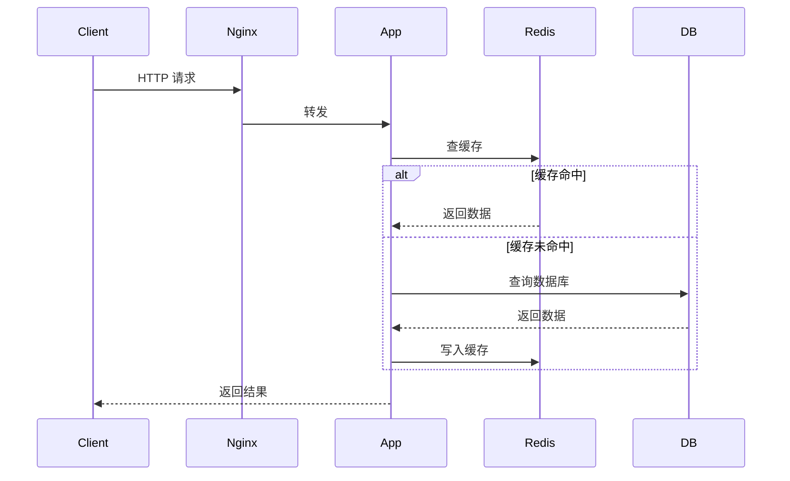

# 技术写作

> 代码解决问题，文字传递思想。技术写作是工程师最被低估的核心竞争力。

---

## 一、为什么技术写作很重要

### 1.1 写作的本质是深度思考

很多工程师觉得"我懂了，只是不会写"——这其实是一种错觉。如果你真的懂了，你一定能写出来。写不出来，说明理解还不够深。

**写作是强制你把模糊的认知变成清晰结构的过程。**

```
认知状态对比：
- 觉得懂了：能说出大概意思
- 真正懂了：能给不同背景的人解释清楚
- 深刻理解：能写成文章，能举例，能类比，能指出误区
```

### 1.2 技术写作的职业价值

| 维度 | 说明 |
|------|------|
| 个人品牌 | 文章积累形成技术影响力，面试时是有力背书 |
| 晋升加速 | 技术方案、设计文档质量直接影响晋升评审 |
| 团队价值 | 好的技术文档让团队知识沉淀、减少重复答疑 |
| 外部机会 | 技术博客吸引猎头、开源社区、技术会议邀约 |
| 思维锻炼 | 长期写作让你思维更系统、表达更清晰 |

---

## 二、技术写作的分类

### 2.1 按用途分类

```
技术写作
├── 对外写作（分享/影响力）
│   ├── 技术博客（掘金/CSDN/知乎）
│   ├── 源码解析（系列文章）
│   ├── 教程/实战指南
│   └── 技术专栏/电子书
│
└── 对内写作（工作/团队）
    ├── 技术方案文档（RFC）
    ├── 设计文档（Architecture Decision Records）
    ├── Wiki/知识库
    ├── 复盘报告（故障/项目）
    └── 周报/日报
```

### 2.2 按深度分类

| 类型 | 深度 | 示例 |
|------|------|------|
| 新闻/动态 | 浅 | 某框架发布新版本，新增了 XXX 功能 |
| 使用指南 | 中 | 手把手教你用 XXX，含完整代码 |
| 原理分析 | 深 | XXX 的底层实现原理深度解析 |
| 系统性综述 | 很深 | XXX 领域技术全景图 |
| 思考/观点 | 因人而异 | 我对 XXX 技术的看法与取舍 |

---

## 三、技术文章的结构模板

### 3.1 通用结构：SCQA 模型

```
S（Situation）：现状/背景
   └── 你的读者当前面对什么情况？

C（Complication）：冲突/问题
   └── 现状有什么问题？为什么需要改变？

Q（Question）：核心问题
   └── 本文要回答的核心问题是什么？

A（Answer）：解答
   └── 你给出的答案/解法/分析
```

**示例：Redis 缓存穿透文章**
- S：大量请求打到 Redis，缓存可以显著降低 DB 压力
- C：但查询不存在的 key 时，缓存无法命中，请求会直达 DB
- Q：如何解决缓存穿透问题？
- A：布隆过滤器 / 空值缓存 / 参数校验

### 3.2 技术原理文章结构

```markdown
# 文章标题（明确、有吸引力）

## 一、问题背景（为什么要讲这个）
## 二、核心概念（基础知识铺垫）
## 三、原理深入（核心内容）
   - 数据结构 / 算法 / 流程图
   - 关键代码片段
   - 与其他技术的对比
## 四、实战示例（理论落地）
   - 完整可运行的代码
   - 踩坑与注意事项
## 五、总结（精华提炼）
   - 核心要点 3-5 条
   - 适用场景
   - 延伸阅读
```

### 3.3 技术方案文档结构（内部 RFC）

```markdown
# [方案] 标题

## 背景与目标
- 现状描述
- 问题/痛点
- 目标（可量化）

## 方案设计
### 方案一：XXX
- 思路
- 优点
- 缺点
- 适用场景

### 方案二：XXX（同上）

### 方案对比
| 维度 | 方案一 | 方案二 |
|------|--------|--------|

### 推荐方案
- 选择理由
- 风险与规避措施

## 实施计划
- 里程碑
- 依赖项
- 回滚方案

## 参考资料
```

---

## 四、写好技术文章的关键技巧

### 4.1 标题写作

标题决定 70% 的点击率。

```
❌ 差的标题：
- "介绍一下 HashMap"
- "关于 Redis 的一些总结"
- "Spring AOP 学习笔记"

✅ 好的标题：
- "HashMap 源码深度解析：为什么容量必须是 2 的幂？"
- "Redis 缓存三大问题（穿透/击穿/雪崩）彻底搞懂"
- "Spring AOP 底层原理：JDK 动态代理 vs CGLIB，一文搞清楚"
```

好标题的要素：
1. **明确**：读者知道读完能收获什么
2. **具体**：有数字/关键词，避免模糊
3. **有张力**：提出问题、对比、或承诺

### 4.2 开篇技巧

前 3 行决定读者是否继续往下读。

```
常见开篇方式：
1. 提出痛点：    "你有没有遇到过 Redis 突然被打崩的情况？"
2. 反直觉：      "99% 的人对线程池的理解都是错的"（慎用，容易被怼）
3. 背景故事：    "某次线上故障，根因是 HashMap 并发修改..."
4. 数据/事实：   "一个 ConcurrentHashMap 在高并发下性能比 HashMap 差 30%？"
5. 问题清单：    "本文回答以下三个问题：1. 2. 3."
```

### 4.3 图的使用

技术文章里，一张好图胜过百行文字。

```
图的类型：
├── 流程图    → 请求处理流程、算法步骤
├── 架构图    → 系统组件关系
├── 时序图    → 组件交互过程
├── 数据结构图 → 链表/树/哈希表的内存布局
└── 对比表    → 不同方案的优劣
```

**绘图工具推荐：**
- draw.io（免费，在线，功能强大）
- Excalidraw（手绘风格，适合草图）
- PlantUML / Mermaid（代码生成图，适合内嵌 Markdown）
- SequenceDiagram.org（时序图专用）

### 4.4 代码示例的写法

```java
// ❌ 坏的代码示例：缺少上下文，无法直接运行
public void doSomething() {
    // ...省略N行...
    result = process(data);
}

// ✅ 好的代码示例：
// 1. 完整可运行（或有清晰的省略说明）
// 2. 关键行有注释
// 3. 有输入/输出示例
public static int[] twoSum(int[] nums, int target) {
    Map<Integer, Integer> map = new HashMap<>();
    for (int i = 0; i < nums.length; i++) {
        int complement = target - nums[i];
        if (map.containsKey(complement)) {
            return new int[]{map.get(complement), i}; // 找到答案直接返回
        }
        map.put(nums[i], i); // 存入当前值和索引
    }
    return new int[]{};
}
// 输入：nums=[2,7,11,15], target=9
// 输出：[0, 1]
```

### 4.5 对比表的写法

对比表是技术文章的杀手锏，让读者快速理解多个技术的差异。

```markdown
| 特性 | Redis | Memcached |
|------|-------|-----------|
| 数据结构 | String/Hash/List/Set/ZSet | 只有 String |
| 持久化 | RDB + AOF | 不支持 |
| 集群 | 原生支持 | 客户端实现 |
| 事务 | 支持（弱事务） | 不支持 |
| 适用场景 | 功能丰富，首选 | 纯缓存，内存利用率略高 |
```

---

## 五、常见写作误区

### 5.1 复制粘贴官方文档

❌ 错误做法：
```
Spring AOP 是一个面向切面编程框架，它通过横切关注点（cross-cutting concerns）
的模块化来提高程序的模块性...（官方文档原文）
```

✅ 正确做法：用自己的话解释，并补充官方没说的实战价值：
```
Spring AOP 简单说就是：你不用改业务代码，也能在方法执行前后"插入"逻辑。
典型场景：日志、权限校验、事务管理——这些横跨多个模块的通用逻辑，
统一用 AOP 处理，业务代码干净多了。
```

### 5.2 只有概念没有实战

技术文章的价值在于帮读者解决实际问题。每个概念点之后，尽量配一个：
- 真实使用场景
- 代码示例
- 踩坑经验

### 5.3 文章太长，没有重点

> 如果我有更多时间，我会写一封更短的信。—— Pascal

技术文章不是越长越好。找到核心问题，把它说透，比面面俱到但每点浅尝更有价值。

**精简原则：**
1. 每段只表达一个核心观点
2. 删掉所有"众所周知"的废话
3. 能用图说明的，不用长文
4. 代码示例只保留关键部分

---

## 六、持续写作的习惯建立

### 6.1 素材积累（写作前）

写不出来，通常是因为没有素材，而不是不会写。

```
日常素材积累方法：
1. 工作笔记：每次排查问题、学新技术，随手记下来
2. 问题清单：遇到搞不懂的，先记下来，研究后写成文章
3. 输出倒逼输入：定下"每月2篇"的目标，倒逼自己去学
4. 碎片时间整理：通勤/午休时看别人文章，思考自己的理解
```

### 6.2 写作流程（写作时）

```
推荐流程：
1. 确定主题（5 分钟）：一句话说清楚"本文讲什么，对谁有用"
2. 打骨架（10 分钟）：写下所有章节标题，不要开始写正文
3. 填肉（专注时间）：按章节顺序写，遇到卡壳先跳过
4. 补素材（查资料时）：代码验证、翻源码、找参考链接
5. 润色（最后）：检查逻辑是否通顺，删掉冗余内容
```

### 6.3 发布平台选择

| 平台 | 特点 | 适合内容 |
|------|------|---------|
| 掘金 | 技术氛围好，Java/前端用户多 | 系统性技术文章 |
| CSDN | 流量大，SEO 好，广告多 | 教程类，追求曝光 |
| 知乎 | 问答场景，适合深度内容 | 原理分析、观点文章 |
| 博客园 | 老牌平台，技术纯粹 | 深度技术博客 |
| GitHub Pages | 自建博客，完全掌控 | 个人品牌建设 |
| 微信公众号 | 粉丝沉淀，变现路径多 | 成体系的内容输出 |

**推荐策略：** 主力选 1-2 个平台深耕，其余平台做分发（同一篇文章多平台发布）。

---

## 七、技术写作进阶：从文章到体系

### 7.1 专栏/系列文章

单篇文章的影响力有限，系列文章才能真正建立技术权威。

```
成功案例参考：
- "深入理解 JVM" → 系列文章形成了经典书籍
- "Java 并发编程的艺术" → 从实践经验提炼成体系

你的专栏规划：
1. 找到你的专长（分布式 / 中间件 / 某个框架）
2. 规划 10-20 篇系列
3. 定频更新（每周一篇，持续 3-6 个月）
4. 建立目录索引文章（读者可以从任意篇入手）
```

### 7.2 内部技术文档

内部文档是职场中被最低估的写作形式。

**高质量技术文档的标准：**
1. **自说明**：新人读完能直接上手
2. **可维护**：有版本历史，说明最后更新时间
3. **有深度**：不只是"怎么用"，还有"为什么这么设计"
4. **有索引**：重要文档要有目录，方便跳转

**让文档产生价值：**
- 新人入职 Onboarding 文档（减少新人提问时间）
- 系统设计文档（决策依据留存，避免重复讨论）
- 故障复盘文档（经验沉淀，避免重蹈覆辙）
- API 文档（接口调用方无需找你确认细节）

---

## 八、写作工具与效率

### 8.1 工具链推荐

```
写作工具：
├── 编辑器：Typora / Obsidian / VS Code（Markdown Preview）
├── 图表：draw.io / Mermaid / Excalidraw
├── 截图：Snipaste（Windows）/ CleanShot（Mac）
├── 代码展示：Carbon.now.sh（生成漂亮代码图片）
└── 语法检查：Grammarly（英文）/ 秘塔写作猫（中文）

内容管理：
├── 本地笔记：Obsidian / Notion
├── 素材管理：Flomo（闪念胶囊）
└── 发布工具：HexoPub / Markdown Here
```

### 8.2 Mermaid 快速画图

Markdown 内嵌时序图：

````markdown

````

---

## 九、总结

| 阶段 | 目标 | 行动 |
|------|------|------|
| 起步期 | 养成写作习惯 | 每月 1 篇，记录自己的学习和问题排查过程 |
| 成长期 | 提升文章质量 | 加图表、代码示例、对比，追求"读完能用" |
| 影响期 | 建立个人品牌 | 专栏系列化、多平台分发、与读者互动 |
| 成熟期 | 转化为价值 | 电子书、课程、演讲、技术顾问 |

**最重要的一步：开始写第一篇。**

写作能力不是天赋，是通过大量练习养成的技能。每一篇文章都在磨练你的思维和表达。坚持写 100 篇，你的技术深度和表达能力都会发生质变。

---

## 延伸阅读

- 《金字塔原理》—— 结构化表达的底层方法论
- 《风格的要素》（Elements of Style）—— 清晰写作的经典指南
- Paul Graham《How to Write Usefully》—— Y Combinator 创始人谈实用写作
- 《软件随想录》（Joel on Software）—— 技术写作典范
